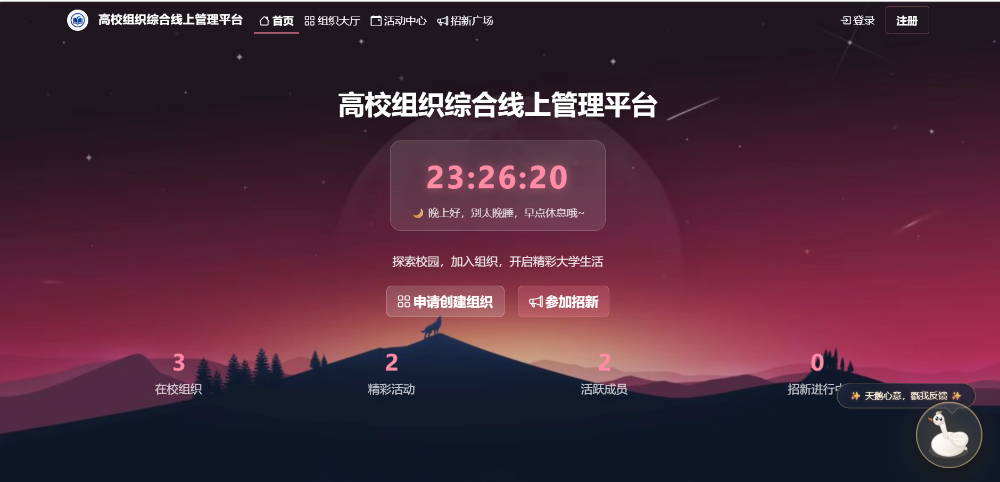
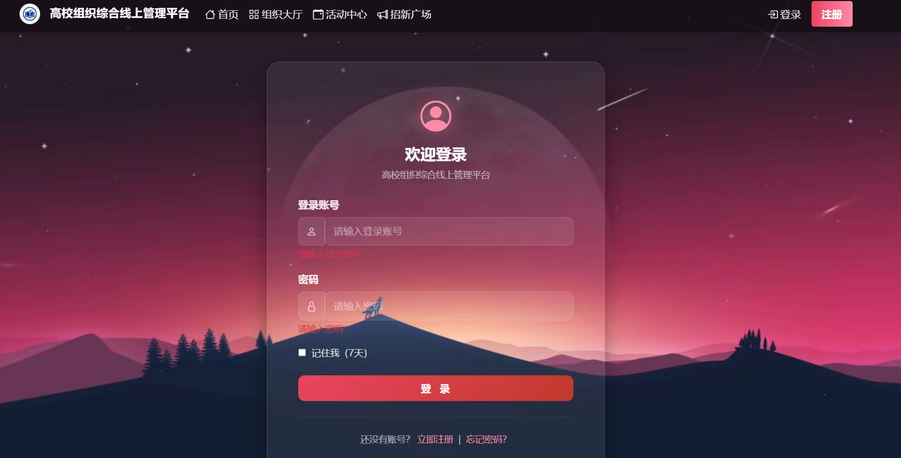
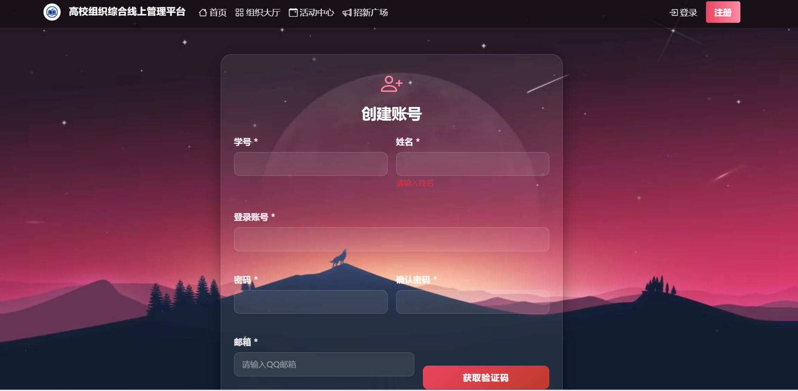
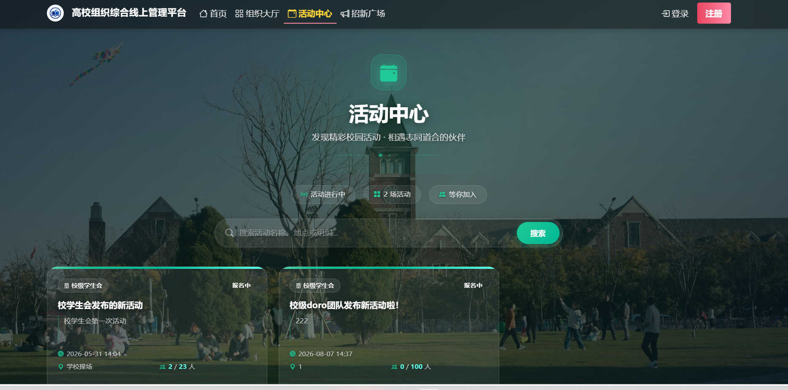
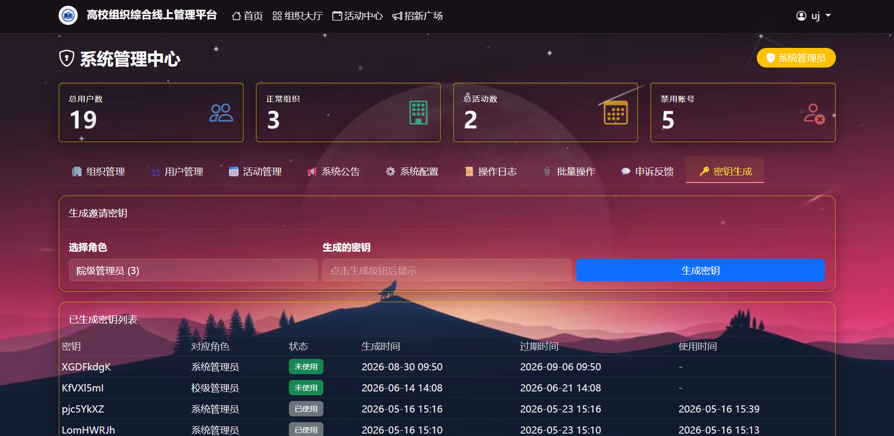

# 高校组织综合线上管理平台

> 一个基于 ASP.NET Web Forms 的高校学生组织管理系统，支持组织申请、活动管理、招新报名、公告发布、多级审核等完整功能。采用玻璃拟态（Glassmorphism）UI 设计风格。

## 📸 项目截图

### 首页大屏



> 首页支持视频背景：将 MP4 视频文件放置于 `OrgManage/videos/hero-bg.mp4`，首页大屏将自动播放循环视频背景。未放置视频时，自动回退为图片背景。

### 登录 / 注册

| 登录 | 注册 |
|------|------|
|  |  |

### 功能页面

| 活动中心 | 管理后台 |
|---------|---------|
|  |  |

## 📋 项目简介

本系统是高校学生组织的综合管理平台，旨在解决学生组织管理分散、信息不透明、审批流程繁琐等问题。系统覆盖组织从申请成立到日常运营的全生命周期管理，支持校级/院级多级审核机制，为学生、组织管理者、学校管理员提供统一的数字化管理平台。

## 🛠 技术栈

| 类别 | 技术 |
|------|------|
| 后端框架 | ASP.NET Web Forms (.NET Framework 4.7.2, C#) |
| 数据库 | SQL Server (LocalDB) |
| 架构模式 | 三层架构（UI / BLL / DAL） |
| 前端框架 | Bootstrap 5 + jQuery |
| UI 风格 | 玻璃拟态（Glassmorphism）+ 深色主题 |
| 图标库 | Bootstrap Icons |
| 开发工具 | Visual Studio |

## ✨ 功能模块

### 👤 学生端
- **组织大厅**：浏览所有组织，按分类筛选，查看组织详情
- **活动中心**：浏览活动，在线报名
- **招新广场**：查看招新信息，提交报名申请
- **个人中心**：消息通知、我的组织、我的活动、个人信息

### 🏢 组织管理员端
- **成员管理**：查看成员列表、添加/移除成员
- **招新管理**：发布招新、审核报名申请、录用/拒绝
- **活动管理**：发布活动、查看报名名单
- **公告管理**：发布组织公告、删除公告
- **信息编辑**：修改组织名称、Logo、简介等

### 🛡 管理后台（校级 / 院级管理员）
- **组织审核**：审核组织成立申请、组织解散申请
- **活动管理**：活动上下架、强制取消
- **用户管理**：用户封禁/解封
- **日志审计**：操作日志、登录日志

## 🏗 系统架构

采用经典三层架构设计：

```
┌─────────────────────────────────┐
│         UI 层（Web Forms）      │  页面展示 + 用户交互
├─────────────────────────────────┤
│      BLL 层（业务逻辑层）       │  业务规则 + 权限校验
├─────────────────────────────────┤
│      DAL 层（数据访问层）       │  DbHelper + SQL 操作
├─────────────────────────────────┤
│        SQL Server 数据库        │  数据持久化存储
└─────────────────────────────────┘
```

**核心业务逻辑类：**
- `OrgBLL.cs` — 组织管理业务逻辑
- `ActivityBLL.cs` — 活动管理业务逻辑
- `RecruitBLL.cs` — 招新管理业务逻辑
- `UserBLL.cs` — 用户管理业务逻辑
- `MessageBLL.cs` — 站内消息业务逻辑
- `DbHelper.cs` — 数据库访问封装

## 🗄 数据库

共 26 张数据表，核心表包括：

| 表名 | 说明 |
|------|------|
| `Users` | 用户表 |
| `Organizations` | 组织表 |
| `OrgMembers` | 组织成员表 |
| `OrgCategories` | 组织分类表 |
| `Activities` | 活动表 |
| `ActivityEnrollments` | 活动报名表 |
| `Recruitments` | 招新表 |
| `RecruitApps` | 招新报名表 |
| `OrgAnnouncements` | 组织公告表 |
| `Announcements` | 系统公告表 |
| `UserMessages` | 用户消息表 |
| `OperationLogs` | 操作日志表 |
| `LoginLogs` | 登录日志表 |

> 完整建表脚本见 `Database/CreateTables.sql`，初始数据见 `Database/SeedData.sql`

### ER 关系概览

```
Users ──┬── OrgMembers ── Organizations ── OrgCategories
        │                                    │
        ├── ActivityEnrollments ─── Activities ──┤
        │                                        │
        ├── RecruitApps ───────── Recruitments ──┘
        │
        └── UserMessages
```

## 🚀 本地运行

### 环境要求
- Visual Studio 2019/2022
- .NET Framework 4.7.2
- SQL Server LocalDB（随 Visual Studio 安装）

### 运行步骤

1. **克隆项目**
   ```bash
   git clone <repo-url>
   cd OrgManage
   ```

2. **创建数据库**
   - 在 Visual Studio 中打开 `OrgManage.sln`
   - 打开 SQL Server 对象资源管理器
   - 执行 `Database/CreateTables.sql` 创建所有表
   - 执行 `Database/SeedData.sql` 插入初始数据

3. **修改连接字符串**（如需要）
   - 打开 `Web.config`
   - 修改 `OrgManageDB` 连接字符串指向你的数据库

4. **配置邮箱（可选）**
   - 打开 `Web.config`
   - 将 `MailAccount` 和 `MailAuthCode` 替换为你自己的邮箱和授权码
   - 或设置环境变量 `ORGMAIL_ACCOUNT` 和 `ORGMAIL_AUTHCODE`（推荐）

5. **运行项目**
   - 按 `F5` 或点击「IIS Express」运行
   - 默认首页地址：`http://localhost:xxxx/Default.aspx`

### 初始账号

> 首次运行请自行注册账号。需要管理员权限可在数据库中手动修改 `Users` 表的 `Role` 字段：
> - `Role = 1`：普通学生
> - `Role = 2`：组织管理员
> - `Role = 3`：院级管理员
> - `Role = 4`：校级管理员
> - `Role = 5`：系统管理员（最高权限，可管理所有模块）

## 🎨 项目亮点

1. **玻璃拟态 UI**：全站采用 Glassmorphism 设计风格，配合深色背景和动画效果，视觉效果出色
2. **完整权限体系**：四级用户角色（学生 / 组织管理员 / 院级管理员 / 校级管理员），权限分离清晰
3. **多级审核流程**：组织成立、解散均走审核流程，校级/院级分类管理
4. **站内消息系统**：申请结果、活动通知、招新结果实时推送，支持未读标记
5. **文件上传**：支持组织 Logo 上传与预览
6. **操作审计**：关键操作均有日志记录，支持追溯

## 📁 项目结构

```
OrgManage/
├── Account/              # 账号相关（登录、注册、个人中心等）
├── Admin/                # 后台管理页面
├── App_Code/             # 业务逻辑层（BLL）
│   ├── DbHelper.cs
│   ├── OrgBLL.cs
│   ├── ActivityBLL.cs
│   ├── UserBLL.cs
│   └── ...
├── App_Data/             # 数据库文件（mdf）
├── Content/              # CSS 样式
├── Manage/               # 组织管理页面
├── Orgs/                 # 组织相关页面
├── Activities/           # 活动相关页面
├── Scripts/              # JavaScript 库
├── images/               # 图片资源
├── Database/             # 数据库脚本
│   ├── CreateTables.sql  # 建表脚本
│   └── SeedData.sql      # 初始数据
├── Site.master           # 母版页
├── Default.aspx          # 首页
├── Web.config            # 配置文件
└── OrgManage.sln         # 解决方案文件
```

## 📝 开发说明

本项目为课程设计项目，技术栈选用 ASP.NET Web Forms 是课程要求。项目开发过程中实践了以下软件工程知识点：

- 三层架构设计与解耦
- 数据库设计与 SQL 优化
- 用户认证与权限控制
- 参数化查询防 SQL 注入
- XSS 防护（HTML 编码输出）
- 文件上传安全处理
- UI/UX 设计与动效实现

## 📄 License

本项目仅用于学习和课程设计参考。
